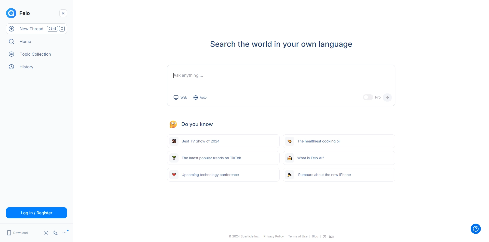
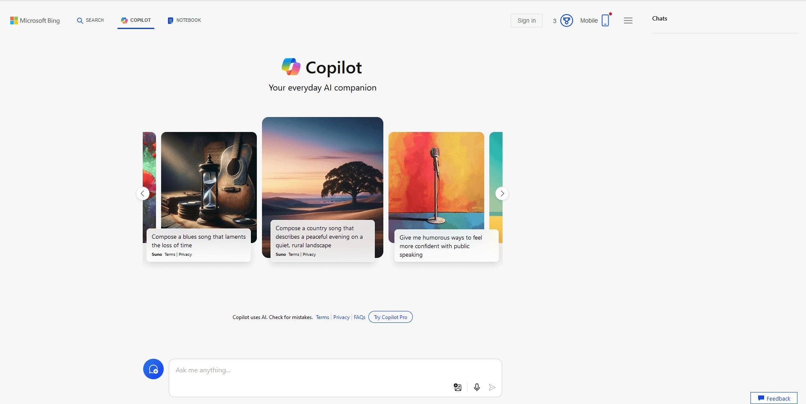
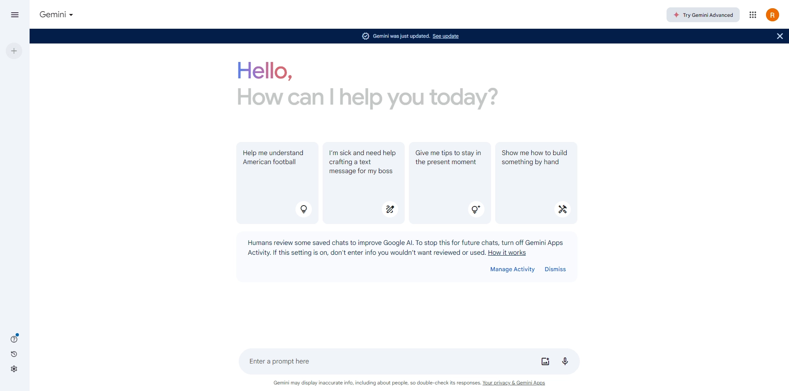
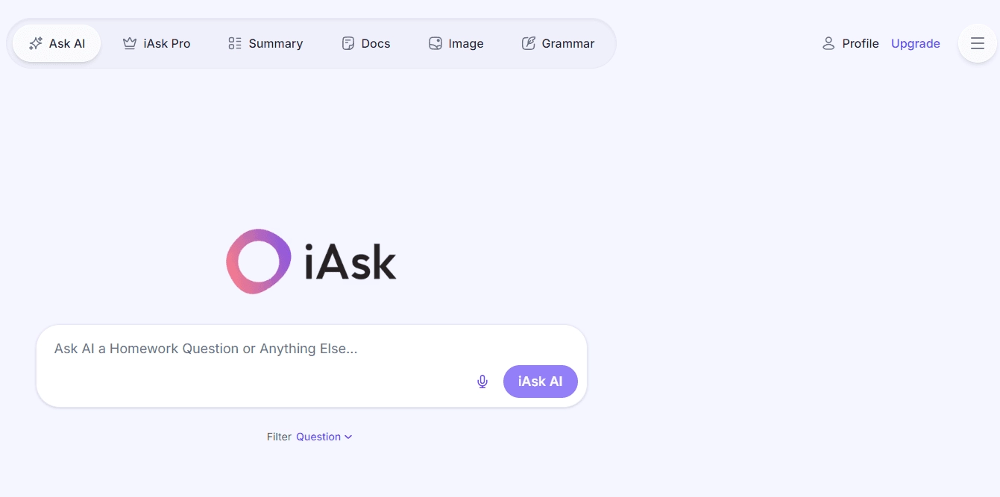
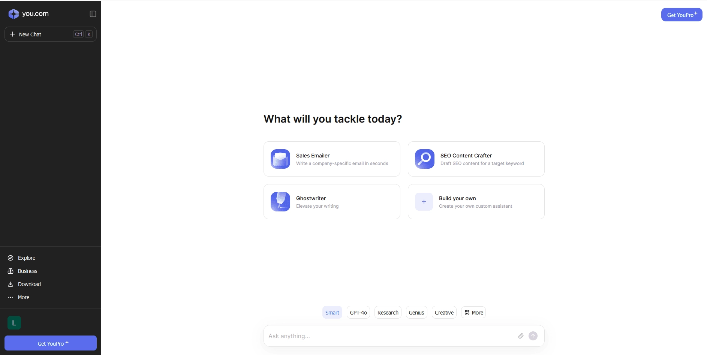
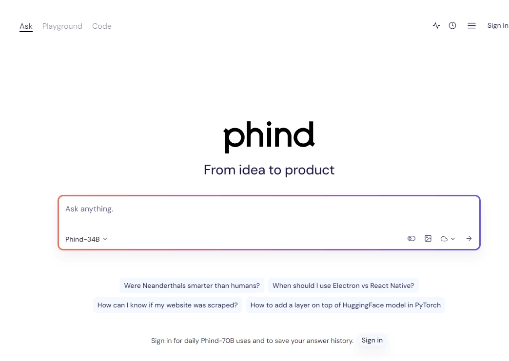
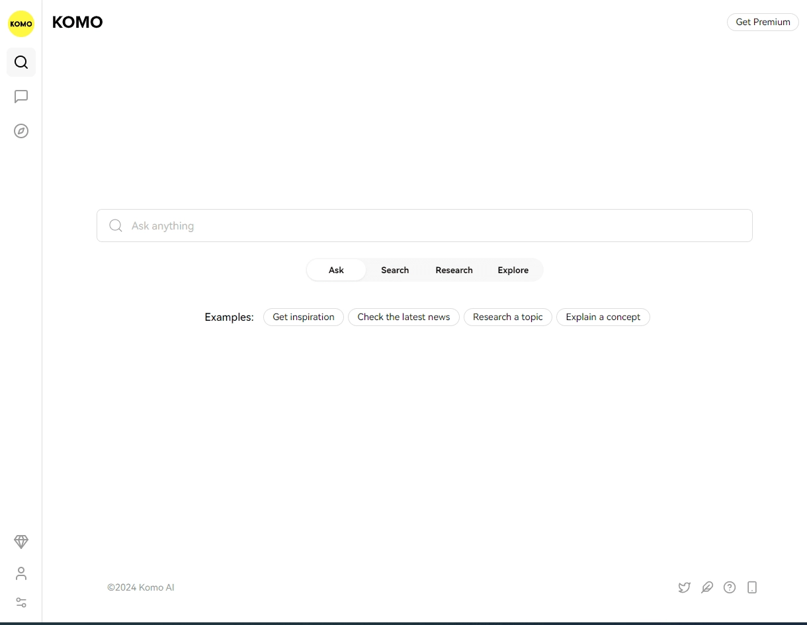
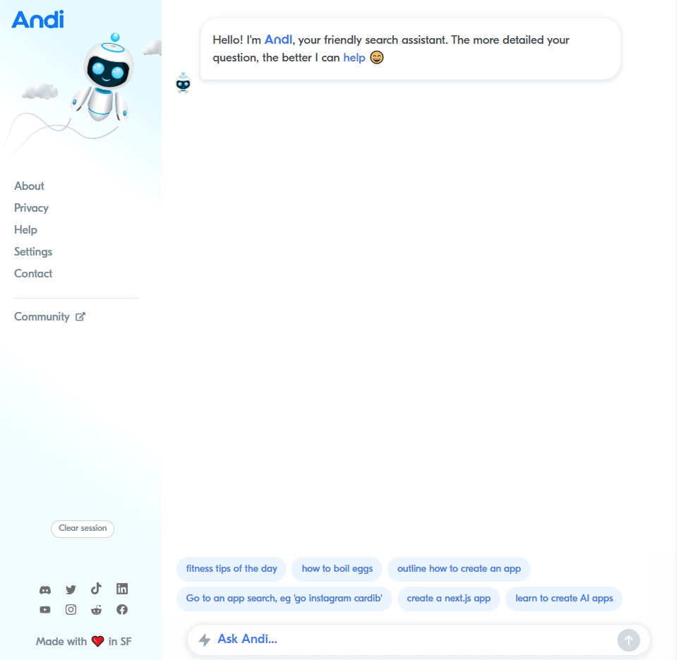
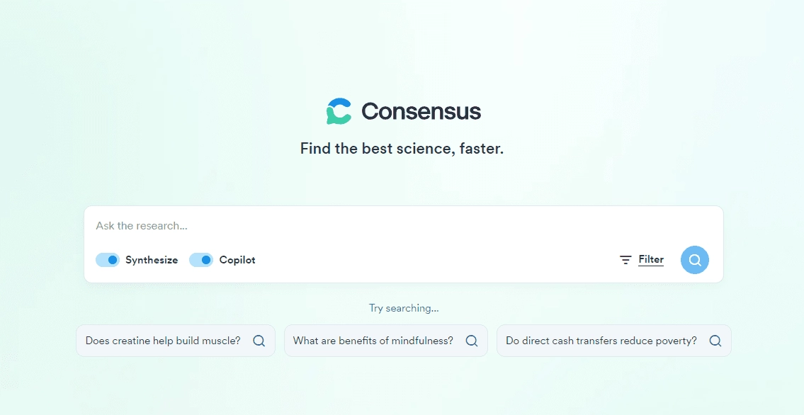

# 2025年,这10个AI搜索工具比Perplexity更好用

你是不是也在用Perplexity搜东西?

说实话,它确实挺火的,但用着用着就发现——答案有时候不太准,免费版限制又多,想深度研究个什么还得掏钱订阅。如果你也有这些困扰,那正好,我最近试了不少替代品,发现有些工具在某些场景下真的比Perplexity好用多了。

这篇文章就是想和你聊聊这10个AI搜索引擎。它们各有各的绝活——有的特别擅长学术研究,有的专门服务程序员,还有的界面简单到让人想哭。我会把每个工具的优缺点都说清楚,你看看哪个最对你胃口。

---

## Felo.ai - 如果只推荐一个,就选它

Felo.ai最开始是个AI写作工具,后来转型做搜索引擎,结果越做越厉害。现在它用的是市面上最先进的在线搜索技术之一,关键是——免费。

你问什么问题,它都能给你准确、最新的答案,还会附上参考来源。不像有些工具,给你一堆模棱两可的回答,看完还是不知道怎么办。

**它最厉害的几个点:**

**文件搜索功能** - 你可以直接搜PDF、DOC这些文档,对学生和上班族来说简直是神器。写论文、做报告的时候,再也不用在一堆网页里翻来翻去找资料了。

**学术论文搜索** - 这个功能太实用了。你要找最新的研究、白皮书、会议论文,它都能帮你快速定位。

**主题对话** - 这是我最喜欢的功能。你搜到的任何资料都可以放进一个专门的主题里,然后和AI继续聊这个话题。这不是简单的问答,是真的能帮你深入理解内容。

如果你需要一个靠谱的AI搜索助手,特别是要处理文档和学术资料的话,👉 [Felo.ai绝对是你的第一选择,现在就试试这个Perplexity Pro年费成品号的最佳替代方案](https://shaoyumi.com/buy/64)。它把搜索、文档处理、学术研究和深度对话都整合在一起,用起来既高效又顺手。

---

## Bing - 微软出品,稳定可靠

微软的Bing现在用的是GPT-4,还整合了Copilot助手。这个组合在2023年推出后,让Bing一下子变得聪明了很多。

作为日常AI助手,Bing能给你准确、最新的答案。你输入问题,它会在网上搜一圈,然后根据搜索结果告诉你答案。

**好在哪儿:**
- 桌面和手机都能用
- 有各种专门的GPT可以选,针对不同主题
- 信息通常比较准确可靠

**不太好的地方:**
- 界面有点乱,新手可能要适应一下

---

## Gemini - 谷歌家的AI搜索

Gemini以前叫Bard,是谷歌为了应对ChatGPT推出的。2023年上线后,一直在不断优化。

它不仅是个聊天机器人,还是谷歌搜索引擎的AI助手,叫"AI概览"。速度快、效率高,能从搜索结果里提取关键信息,直接给你生成答案。

**好在哪儿:**
- 谷歌出品,技术实力没得说
- 免费使用
- 操作很流畅,用户体验不错

**不太好的地方:**
- 之前出过几次bug,给出的答案有点奇怪,虽然现在好多了

---

## iAsk - 功能最全的那个

iAsk是芝加哥一家公司在2023年初推出的,现在每天有超过一百万次查询。它火起来主要是因为免费版就已经很好用了。

最厉害的是它的过滤功能。你可以选择问题来源——一般信息、学术资料、实时数据、论坛讨论、维基百科,甚至是专家深度分析。还支持语音搜索,自带语法检查和图像生成工具。

**好在哪儿:**
- 免费版功能就很强大
- 集成了很多AI工具
- 搜索结果可以深度定制

**不太好的地方:**
- 一些高级功能要付费才能用

---

## You.com - 最个性化的搜索体验

You.com是第一个整合大型语言模型的平台,创始人都是自然语言处理专家,拿到了2500万美元投资。

它最特别的地方是个性化。你可以和各种AI助手互动,从"智能型"到"创意型"都有,完全可以根据自己的喜好来定制体验。

**好在哪儿:**
- 聊天机器人式的搜索体验
- AI模型选择很多
- 免费注册就能用

**不太好的地方:**
- 偶尔结果不够准确或者不够新

---

## Phind - 程序员专属搜索引擎

Phind在2022年推出,专门为开发者设计。创始人之前都在微软和谷歌工作,技术背景很强。

它的口号是"从想法到产品",专门帮程序员解决编码问题,支持各种编程语言和软件问题。如果你是开发者或者设计师,这个工具会让你觉得它懂你。

**好在哪儿:**
- 技术问题回答得很专业
- 对开发者和设计师特别友好
- 提供大量学习资源

**不太好的地方:**
- 不适合普通用户
- 更复杂的模型要付费订阅

---

## Komo - 最简单易用的那个

Komo把生成式AI和聊天功能结合起来,能快速给你提供信息。它的重点是提升聊天体验,让你在浏览网页的时候有AI支持。

它用markdown语言来展示结果,看起来很清爽。你输入问题,它会迅速给你准确、全面的回答。

**好在哪儿:**
- 界面友好,新手也能快速上手
- 生成结果很快
- 定价灵活,适合各种预算

**不太好的地方:**
- 高级功能有限,工具集比较基础

---

## Andi - 最容易上手的AI搜索

Andi在2021年推出,虽然现在市场份额还不大,但用户在稳步增长。

它把AI聊天机器人和AI搜索结合得很好。你可以和AI助手"Andi"互动,问简单的问题或者复杂的请求都行。它努力为各种查询提供清晰、相关的答案,界面也很友好。

**好在哪儿:**
- 非常直观,容易使用
- 结果相关且有帮助
- 能处理各种复杂查询

**不太好的地方:**
- 问题越详细,回答越好
- 高级功能有限

---

## Algolia - 企业和网站管理员的选择

Algolia成立于2012年,最近转向AI搜索。它拿到了1.5亿美元的D轮融资,估值达到22.5亿美元。

它主要服务网站管理员和企业,提供AI搜索引擎供整合到网站和平台中。技术很成熟,每年支持超过1.7万亿次搜索。

**好在哪儿:**
- 技术稳定且成熟
- 团队经验丰富
- 提供API,对开发者很友好

**不太好的地方:**
- 不适合个人用户
- 价格比较高

---

## Consensus - 学术研究的最佳工具

Consensus是专门的学术搜索引擎,用AI简化研究过程。它能让你快速访问超过2亿篇研究论文。

**主要功能:**
- AI摘要:从复杂研究中生成简明见解
- 共识计量器:可视化各种主题的科学共识
- 搜索过滤器:通过研究设计、样本大小等细化结果

**好在哪儿:**
- 快速访问庞大的研究数据库
- 界面友好,导航效率高
- AI摘要节省时间

**不太好的地方:**
- AI摘要可能不够准确
- 有些人更喜欢传统搜索方法

---

## Arc Search - 移动端的创新浏览器

Arc Search在2024年推出,是款创新的移动浏览器,融合了浏览、搜索和AI技术。

**主要特点:**
- "为我浏览"功能:生成自定义网页,总结搜索结果
- 直观导航:轻松滑动和刷新
- 跨设备同步:移动和桌面无缝同步
- 注重隐私:阻挡广告和追踪器

**好在哪儿:**
- 独特的AI功能,个性化搜索结果
- 移动端体验优化得很好
- 快速且无广告

**不太好的地方:**
- 一些功能还在开发
- AI引用和个性化还有待完善

---

## 写在最后

如果Perplexity让你失望了,或者你就是想试试更好的工具,这10个选项都值得一试。每个都有自己的特色,可能更适合你的具体需求。

要我推荐的话,👉 [**Felo.ai**是最稳妥的选择,技术强大,性能出色,答案准确又详细,现在就体验Perplexity Pro年费成品号的完美替代方案](https://shaoyumi.com/buy/64)。不管你是学生、研究员、程序员还是普通用户,它都能满足你的搜索需求。试试看,说不定就找到你的完美AI搜索工具了!
